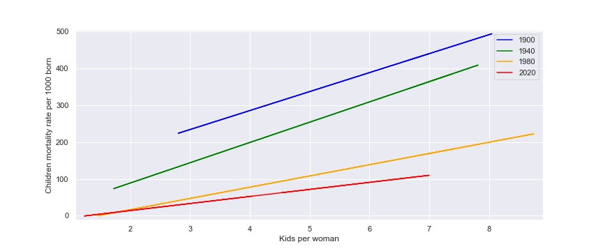

## Table of Contents
1. Import libraries
2. Import files, create dataframe and clean
3. Trends analysis
4. Statistical analysis by region
5. Analysis of correlation
6. Pearson correlation
7. Linear regression

# Fertility and kids (under 5 y.o.) mortality rate 

## Intorduction
It's a training project to discover trends and correlations between fertility, children mortality under 5y.o., income level and life expectancy in different regions.

## Technologies
1. Python
2. Matplotlib
3. Seaborn
4. Pandas
5. Prophet

## Observations and conclusions:
1. There were about 2.2 children per woman in 2020 for mostly number of countries (50%):

On the following chart we can observe ecdf chart of fertility in 2020. 

2. Analysing XX and beginning of XXI centuries, we can see that after babyboom in 1960 there is a decresing trend all over the world except Africa region, where the decreasing started after 1980:

3. On the following chart we can observe forecast of the world trends for the next 20 years.

4. Fertility analyse by region. I've prepared several different types of chart to find the best way to visualise trends. Europe and North America donèt have a big variety, nevertheless Asia, Africa and Oceania regions shows big diversity depending on country.

5. There is a strong correlation (pearson correlation is 0.86) of mortality rate and number of children per woman that we can also observe on the following charts. Also, we can see that during last century there is also a tendency of decreasing chilt mortality as well as number of child per woman.

Regression lines looks like:

Tendency for years 1900-2020 we can observe on the following chart:

6. Correlation between number of children and life expectancy is also strong but negative (-0.78). Here we can observe also that countries with higher income trend to have higher life expectancy (that is obviouse) and less children per woman.

## Examples of use
Correlation analyses

## Sources
This data was downloaded from the Gapminder website: https://www.gapminder.org/data/